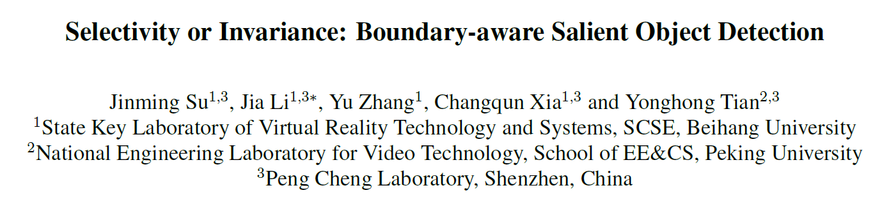
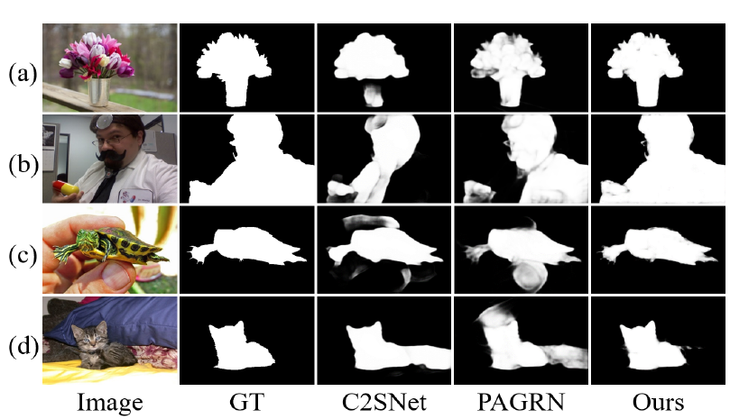
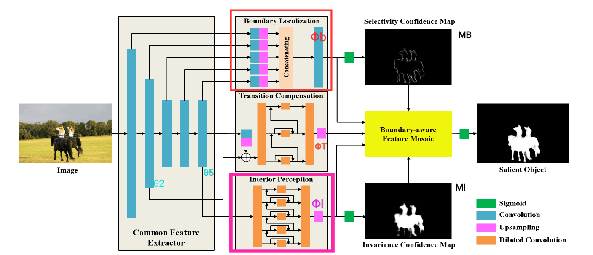
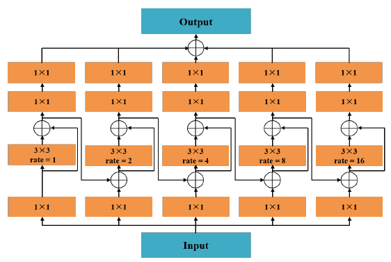
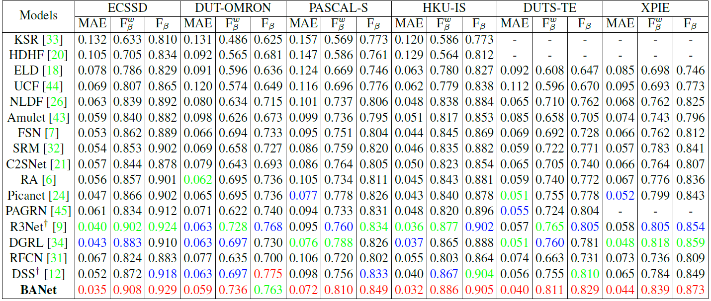
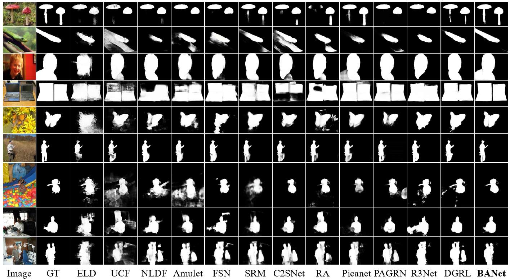

作者 | 文永亮

学校 | 哈尔滨工业大学（深圳）

研究方向 | 目标检测

## 概要

​	上一次我们介绍了**CVPR2019**的[BASNet](https://zhuanlan.zhihu.com/p/72063513)，**CVPR2019**的那篇**BASNet**主要通过引入结构相似性损失$l_{ssim}$使网络更关注边界。这次的**ICCV2019**有一篇“撞车”论文，可选择性与不变性之关注边界的显著性目标检测（文中称其网络为BANet），是**北航、北大**和**深圳鹏城实验室**的paper，其实比引入关注边界的loss更加暴力，它的亮点就在于**直接增加一条分支网络提取预测边界**，后面结合显著性目标的内部共同组成特征做监督训练。在效果方面其实两篇关注边界的都相差不大，**MAE**方面似乎**BANet**要比**BASNet**低一点，但是$F_\beta$的评价下，**BASNet**要比**BANet**要高一点。

## 两个问题

​	

Fig 1. 不同区域的显著性检测需要不同的特征

**SOD（Salient Object Detection）**是关于人眼注意的显著性物体的任务，存在着两个问题：

- 一个大的显著性物体内部存在很大的外观变化导致很难当做一个完整的物体，如**Fig1**中的**(a)(b)**
- 显著性物体的边界很混杂很难从周围背景中分辨出来，如**Fig1**的**(c)(d)**

其实这就关系到了一个**Selectivity-Invariance dilemma**，就是可选择性与不变性的困境，用传统的分类任务来理解，就是同一只狗在不同背景下差别很大，而在相同背景下狗和狼的差异不大，想要把前一组图片中的狗放在一个类别，就是**Selectivity-Invariance dilemma**。这时候的解决方法就是需要一组特征，能够选择性的响应图片中的重要部分，而对图片中的不重要部分的变化保持不变性。这对特征的划分要求很高，如果想让网络完全学出来响应变化可能会导致网络十分敏感，对不重要部分变化（如背景的改变）产生很大反应。

## 模型架构

Fig 2. BANet 的网络结构

这个网络结构的特点：

- **前面是普通的特征提取器**

- **后面分成三个分支：**
1. **边界定位分支**
  
2. **转变补偿分支**
  
3. **内部感知分支**

本文前面的backbone特征提取器使用了ResNet-50。

**边界定位分支**使用了多层特征$\theta_1$至$\theta_5$记为$\pi_B$，通过上采样和拼接融合特征$\phi_B$经过简单的两层卷积得到边界预测，然后使用Sigmoid层生成**可选择性置信度图（selectivity confidence map）**。文中指出使用多层次特征和简单的特征映射子网络是为了使物体边界具有强的可选择性，其损失函数定义如下：
$$
L_B=E(Sig(\phi_B(\pi_B)),G_B)
$$
其中损失函数$E$只是简单的**交叉熵**，$G_B$为**Ground truth**真实标注边界数据。

**内部感知分支**只使用了具有强语义的高层特征，$\phi_I(\pi_I)$强调的是较大显著性物体的内部特征不变性，所以只使用了高层特征和较复杂的子网络，也使用了Sigmoid层导出**不变性置信图（invariance confidence map）**，监督损失函数与$L_B$相似，如下：
$$
L_I=E(Sig(\phi_I(\pi_I)),G)
$$
其中其网络较为复杂，使用了**ISD（integrated successive dilation）**模块。这个模块在后面介绍。

**转变补偿分支**是为了平衡内部和边界之间的可转换区域需要可选择性和不变性，
$$
M=\phi_B\otimes(1-M_I)\otimes M_B+\phi_I\otimes M_I\otimes (1-M_B)+\phi_T\otimes(1-M_I)\otimes (1-M_B)
$$
如Fig2所示，$\otimes$是element-wise product，其实类似交集操作，首先$M_I$是内部图，$M_B$是边界图，二值化的图像意思是白色的像素值为1，黑色的像素值为0，M由三部分组成，加法的第一项，$(1-M_I)$就是背景图，$(1-M_I)\otimes M_B$是两者都认为是边界的地方。$(1-M_B)$是非边界的区域，加法第二项$M_I\otimes(1-M_B)$就是两者都认为是内部的区域。加法第三项$(1-M_I)\otimes(1-M_B)$是表示两者都认为是背景的区域。这样的$M$就是综合了三个分支的特征以及三个分支的置信图的map，最后只需要监督下面这个$L_0$:
$$
L_0=E(Sig(M),G)
$$

最后最小化三个Loss的和：
$$
L=\min\limits_{\{\pi_i\}^5_{i=1},\pi_B,\pi_I,\pi_T}L_0+L_B+L_I
$$

## ISD模块

​	                       

Fig 3. ISD的结构

**ISD(Intergrated successive dilation)**，即**整合连续膨胀模块**，其目的是帮助内部感知分支和转换补偿分支提取嵌入在不同上下文区域中的不变性特征。ISD可以在一系列尺度上**有效聚合上下文信息，增强特征不变性**。

橙色块均为卷积层，**1x1的卷积**目的是用作**通道转换**的，第二层的卷积带有**rate**部分是**膨胀卷积**（也称空洞卷积），比例从左边$2^0$到右边的$2^{N-1}$，总共N个分支，**Fig3**所示为**ISD-5**。第一个分支的特征在经过膨胀卷积之后，与原特征横向相加，然后也会送入第二分支继续做连续的膨胀。这样通过不同连续的膨胀卷积可以感知不同大小的局部上下文。

## 实验结果

400x300的图片在3.60GHz的CPU和**GTX 1080ti GPU**下跑了效果为**13 fps**。可能因为分支多，而且**ISD模块**是连续叠加的所以比[BASNet](https://zhuanlan.zhihu.com/p/72063513)要慢一倍。

Fig 4. BANet与目前16种state-of-arts的方法在6种数据集上的对比。

Fig 5. BANet的检测质量与state-of-arts的算法比较

##总结

**转变补偿分支**的$M$的公式是比较有技巧的一个地方，整个检测分成了三个分支，如何综合利用，在**选择性与不变性**中权衡动态的地方，总体来说效果不错，但是暴力地分离边界必然导致计算的复杂，也是暴力美学的一种形式，因为文章标题与**BASNet**的相似，与其对比在所难免，是结构改变还是loss的计算改变更优雅更接近真理，其实很难断定。