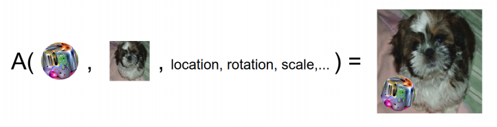
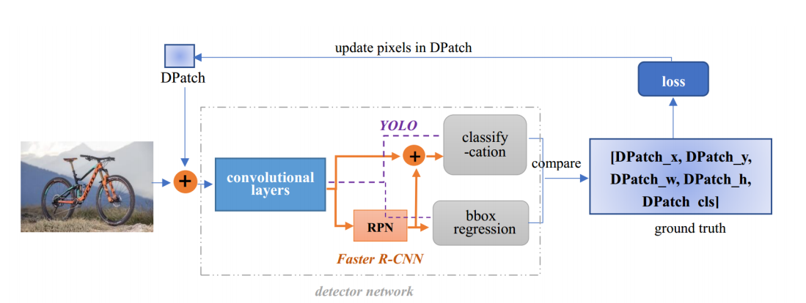
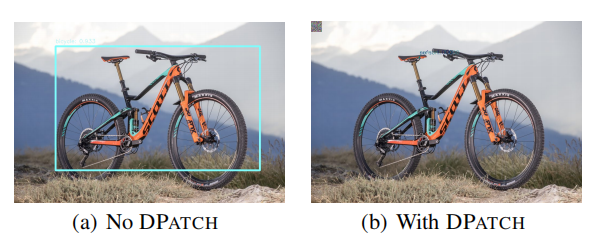
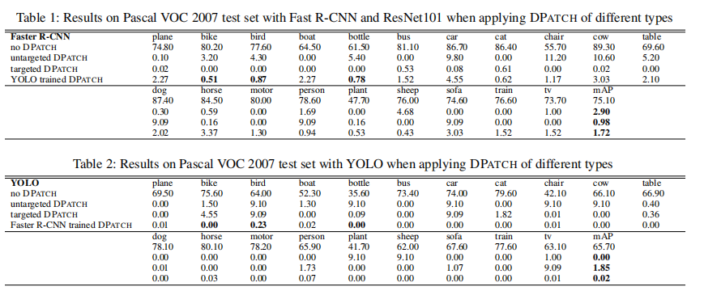
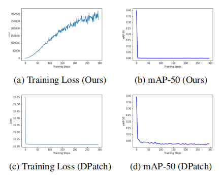
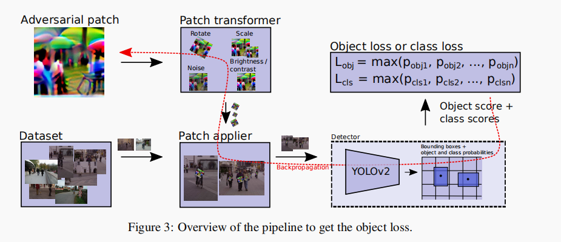
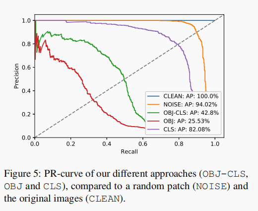

# 【天池大赛】通用目标检测的对抗攻击方法一览

**作者 | 文永亮**

**学校 | 哈尔滨工业大学（深圳）**

**研究方向 | 时空序列预测，目标检测**

------

**赛题**：1000张图，在图上贴补丁，最多不超过10个，导致检测框失效就算得分。

**比赛链接**：https://tianchi.aliyun.com/competition/entrance/531806/information

**数据描述**：从MSCOCO 2017测试数据集中有条件的筛选了1000张图像，这些图像不会包含过多或者过少的检测框（至少会有一个检测框），并且检测框的面积相对于整图不会太小。每张图都被resize到`500 * 500`的大小，并以`.png`的格式存储。

**攻击的检测器**：Faster RCNN， YOLOv4，另外三个是黑盒

最近做了一段时间，分享一下思路，我做的分数不高，只是做个入门介绍。

首先介绍一下相关的论文：

-   Adversarial Patch
-   DPatch
-   On Physical Adversarial Patches for Object Detection
-   Fooling automated surveillance cameras: adversarial patches to attack person detection

## **Adversarial Patch**

### 简要思路

没有接触过对抗攻击的可以从这篇入手，这是第一个在对抗攻击中提出Patch的。传统的对抗攻击就是在原图的基础上加入肉眼不可见的噪音干扰分类器，用数学的方式定义就是，给定分类器$\mathbb{P}\left[y\mid x\right]$，其中$x$ 为样本，$y$ 为样本自身的类别，假设我们需要误判为的目标类别为$\widehat{y}$ ，想要找到一个与$x$ 相近的$\hat{x}$ 最大化 $\log (\mathbb{P}[\widehat{y} \mid \widehat{x}])$ , 相近的约束表示为存在一个 $\varepsilon$误差满足  $\|x-\widehat{x}\|_{\infty} \leq \varepsilon$.

通俗点讲，就是把Patch贴在图上，跟原图相差不大并且使分类器分类失误，如下图表示了Patch粘贴的方式：



### 损失函数

就是最大化目标类别的概率期望，导致分类器误判即可，A就是apply函数，把Patch粘贴到图中的方式，p为Patch的参数，x为原图，l为位置。
$$
\widehat{p}=\arg \max _{p} \mathbb{E}_{x \sim X, t \sim T, l \sim L}[\log \operatorname{Pr}(\widehat{y} \mid A(p, x, l, t)]\\
\left\|p-p_{\text {orig}}\right\|_{\infty}<\epsilon
$$

但是这个与天池的比赛有点差距，因为是目标检测的对抗攻击，不是分类器的对抗攻击，所以就有了下面DPatch的论文，其实道理变化不大。


## DPatch

### 简要思路

这篇是AAAI Workshop2019 的论文，这个思路是最贴切赛题而且非常简单容易实现的，就是在原图的基础上直接添加Patch，固定住YOLO或者Faster R-CNN等检测器的权重，反向传播只更新Patch，文章只在图片的左上角贴了Patch，这里需要看他的损失函数如何设计的。



如下图所示，只在单车左上方贴上40*40的Patch，即可让检测器失效。



### 损失函数

为了训练无目标的DPatch，这里的无目标DPatch是指只需要把检测框失效，不需要把单车误识别为人，这样是有目标攻击。所以我们希望找到一个Patch，假设把Patch贴上图中的apply函数为A，我们需要最大化与真正的类标签$\hat{y}$ 和边界框标签$\hat{B}$ 目标检测器的损失:
$$
\hat{P}_{u}=\arg \max _{P} \mathbb{E}_{x, s}[L(A(x, s, P) ; \hat{y}, \hat{B})] \\
$$


如果是有目标攻击，我们希望找到一个P，它能使目标类标签$y_t$和边界框标签$B_t$的损失最小化:
$$
\hat{P}_{t}=\arg \min _{D} \mathbb{E}_{x, s}\left[L\left(A(x, s, P) ; y_{t}, B_{t}\right)\right]
$$

GT的类别标签在这个比赛中没有提供，其实也很简单，可以直接用未攻击过的检测器模型得到label存下来，我也直接用了官方给的YOLOv4的代码跑了结果存下了类别标签以及检测框BBox的位置，大小。

### 论文效果



从指标上看，小物体如鸟这样的无目标攻击会比较困难。论文作者指出DPatch是具有泛化能力的，YOLO训练出来的Patch给Faster-RCNN用也是没问题的，反之也行。
有一份github的开源代码https://github.com/veralauee/DPatch，我在这个基础上把Patch与pytorch-yolov4结合，做了论文的思路，但是效果不是很好只有56分，如果把Patch贴在中心有200分左右。

## **On Physical Adversarial Patches for Object Detection**

### 简要思路

这是一篇ICML 2019 Workshop的论文，其实就是在DPatch的基础上的一点改进，改进了参数更新的方式，应用对抗攻击的手段，视频效果非常好，先看效果吧。


但是这里他是显示了有目标的全图攻击，把所有的框都失效了，并且把Patch中检测出斑马，这个跟我们的赛题其实不太符合，天池的比赛是把框都失效才有分，如果失效一个又多一个别的框并不得分。

### 改进点

-   给Patch贴的方式发生一些变化，不只是左上的角落，而是增加一些旋转，亮度，位置的变化
-   损失函数用了PGD的方式

第一点其实很容易实现，在贴Patch之前应用一些变换函数上去即可，$\delta$是Patch的参数，$J$是损失函数，权重的更新方式如下：
$$
\delta:=\operatorname{clip}_{[0,1]}\left(\delta+\alpha \cdot \operatorname{sign}\left(\nabla_{\delta} J\left(h_{\theta}(A(\delta, x, t)), y\right)\right)\right.
$$
可以对照着DPatch的更新方式：
$$
\delta:=\delta-\alpha \nabla_{\delta} J\left(h_{\theta}(A(\delta, x, t)), \hat{y}\right)
$$
DPatch的损失函数的更新是直接的最小化目标类别，或者最大化GT的类别，并没有用到对抗攻击的手段，这里直接使用了PGD一阶最强攻击，可以理解为最大化GT类别的一种方式。仔细的看更新方式，最原始的SGD就是沿着梯度的负方向更新达到最小化loss的目的，如果要最大化loss就是得沿着梯度的正方向。PGD的方式，就是对同一样本多次沿着梯度正方向更新，但是更新的值不能太大，所以clip成0到1，也就是每次沿着梯度正方向更新0到1的值数次，达到攻击样本的目的。

### 效果

论文指出这样训练要比DPatch快，可是他也更新了30w轮，而且每轮还多次攻击。



我改了以上的改进点发现并没有太大的改变，也是200分左右。

## Fooling automated surveillance cameras: adversarial patches to attack person detection

### 简要思路

这篇是2019的论文，给了代码的 https://gitlab.com/EAVISE/adversarial-yolo，主要是对人这个类别进行攻击，而天池这个比赛其中人的类别就有600多张是有的，所以1000张中搞定人的类别的框就已经可以说很成功了。其中loss的设计不太符合比赛，因为他这里的loss由三部分组成，考虑了可打印出真实世界进行物理攻击的因素。

方法思路是差不多的，都是在原图上贴Patch然后只更新Patch的部分，在于损失函数如何设计了。



### 损失函数

损失函数包含了三个，其中前两个$L_{n p s},L_{t v}$是关于物理因素的，是可否打印出来进行物理攻击的因素，在$L_{nps}$ 中$p_{patch}$ 是patch P中的一个像素，$c_{print}$ 是一组可打印颜色C集合中的一种颜色。这loss 倾向于使模型中生成的Patch与我们的可打印颜色非常接近。而第二个loss是关于轮廓的smooth程度的，$L_{t v}$ 确保了我们的加了Patch的图像倾向于一个平滑的颜色转换图像。如果相邻像素相似，则loss较低；如果相邻像素不同，loss较高。那我们这个比赛其实**不需要考虑可否打印或者平滑度**，其实我在实践中也没有加入这两个loss去训练。
$$
L_{n p s}=\sum_{p_{\text {paich }} \in p} \min _{c_\text{print} \in C}\left|p_{\text {patch }}-c_{\text {print }}\right|\\
L_{t v}=\sum_{i, j} \sqrt{\left(\left(p_{i, j}-p_{i+1, j}\right)^{2}+\left(p_{i, j}-p_{i, j+1}\right)^{2}\right.}\\
L=\alpha L_{n p s}+\beta L_{t v}+L_{o b j}
$$
最后一项loss是关于有没有物体的，其中YOLO的loss是有一项$L_{obj}$的，YOLO预测得到的output**第四维channel就是该特征的**$L_{obj}$, 但是需要sigmoid后处理，而**5到85维是coco数据集中的80类分类分数**，需要softmax处理。另外0,1,2,3 维分别是x,y,w,h 用处不大。具体代码如下，其中output为YOLOv4模型的输出，n_ch为85维，fsize是特征图大小，人类类别在coco数据集的80类中是第0类，所以confs_for_class只取了第0类的分类分数，最后loss是**分类的分数和有无目标的分数的乘积**。

```python
            output = output.view(batchsize, self.n_anchors, n_ch,
                                 fsize * fsize)
            output = output.transpose(1, 2).contiguous()
            output = output.view(batchsize, n_ch,
                                 self.n_anchors * fsize * fsize)
            output_objectness = torch.sigmoid(output[:, 4, :])  # [batch, 1805]
            output = output[:, 5:n_ch, :]  # [batch, 80, 1805]
            # perform softmax to normalize probabilities for object classes to [0,1]
            normal_confs = torch.nn.Softmax(dim=1)(output)
            # we only care for probabilities of the class of interest (person)
            confs_for_class = normal_confs[:, 0, :]
            confs_if_object = confs_for_class * output_objectness
```

但是作者最后也尝试了多种组合方式，只用分类CLS的loss，只用有无目标OBJ的loss，以及代码所示的两个都用的loss，结果如下图，AP应该越低越好。而用OBJ-CLS的AP值有42.8%，只用OBJ的AP值为25.53%，只用CLS的AP值为82.08%。所以要是无目标攻击的话，最好只攻击OBJ的loss。



我也在天池的比赛中尝试过这篇论文的这个点，但是分数不升反降了。

## 结论

本次比赛重在学习，我也没有做过对抗攻击的研究，这番下来对目标检测对抗攻击领域其实有了一定的了解，也希望能够帮助更多的人入门这个领域，我看到落地的demo有很多，攻击的效果也是惊人，但是我的尝试过后分数并没有明显的提升，也有可能是我训练得次数太少了，目前我都是只训练了最多500轮，论文中都是30w轮的迭代。想法十分有趣，攻击的套路其实变化不大，都是在原图贴Patch，然后设计loss反向传播只更新Patch的参数，另外我发现Patch的位置其实对结果影响很大。