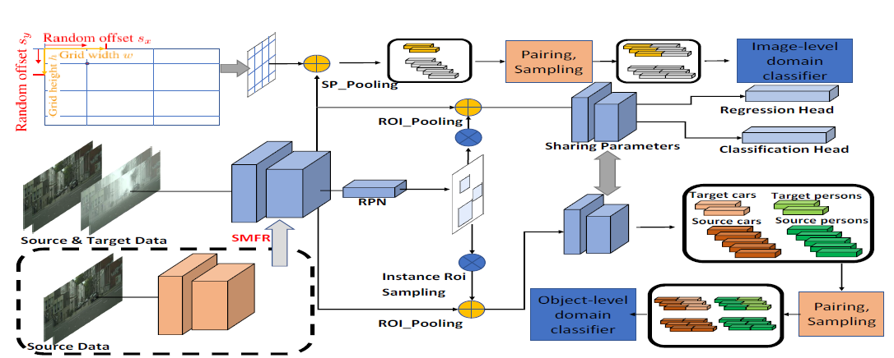
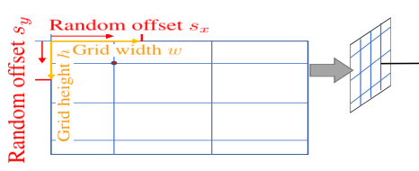
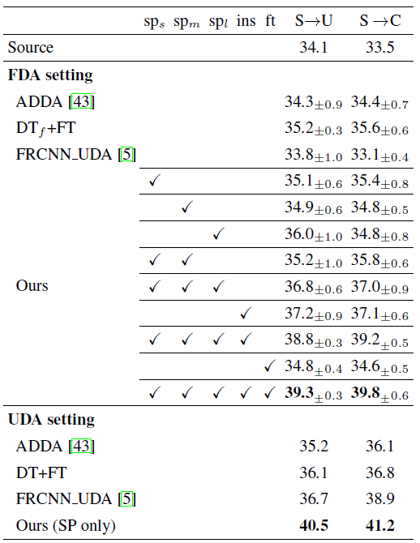
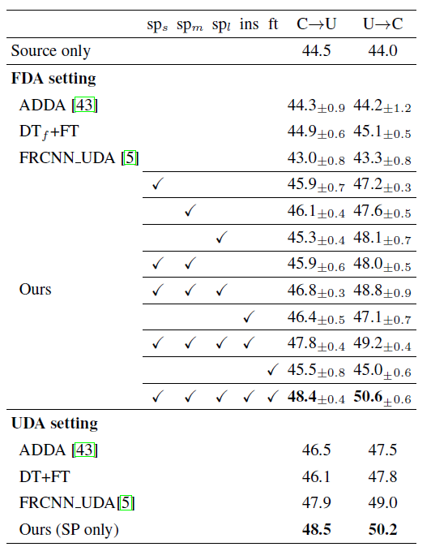
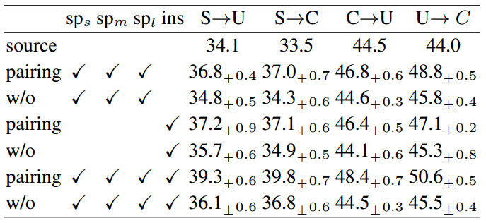
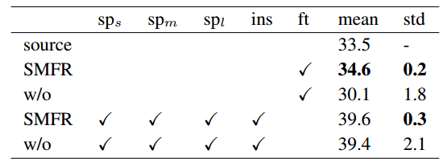

作者 | 文永亮

学校 | 哈尔滨工业大学（深圳）

研究方向 | 目标检测、GAN

## 引文

​	最近笔者也在寻找目标检测的其他方向，一般可以继续挖掘的方向是从目标检测的数据入手，困难样本的目标检测，如检测物体被遮挡，极小人脸检测，亦或者**数据样本不足**的算法。这里笔者介绍一篇**小样本（few-shot）**数据方向下的**域适应（Domain Adaptation）**的目标检测算法，这篇新加坡国立大学&华为诺亚方舟实验室的paper**《Few-shot Adaptive Faster R-CNN》**被收录于**CVPR2019**，解决的具体问题场景是我们有在普通常见场景下的汽车目标检测，我们只有少量雾天暴雨极劣天气环境下的汽车样本，那么我们可以使用成对采样（pairing-sampling）的方法，源域（source domain）即普通场景下的汽车样本$Car_{s}$和目标域（target domain）即**恶劣天气下的汽车样本$Car_{t}$成对$(Car_s,Car_t)$组成负样本**，另一方面**源域下成对组成正样本$(Car_s,Car_s)$**，使用GAN的结构，判别器（discriminator）尽可能去分辨正负样本的不同，也就是**分辨出源域和目标域的样本**，生成器（generator）是尝试去迷惑判别器。这就是这个算法的主要思想，主要是把域适应的思想应用到了目标检测上。

​	论文源码还没完全开源，只找到了个官方的repo：https://github.com/twangnh/FAFRCNN

## 思考

在介绍文章具体网络设计和损失函数的设计之前，我们可以带着一个问题去思考。

1. 用GAN的结构，数据样本使用$Car_s$作为正样本、$Car_t$作为负样本也可以使判别器（discriminator）分辨出源域和目标域的样本，为什么这里要组成对的去训练？

## 算法设计

Fig 1. Few-shot Adaptive Faster R-CNN (FAFRCNN)的整体网络结构（其中的SMFR模块后面会介绍到）

在目标检测的任务中，论文作者把域适应问题分成**两个层次**：

- 1. **图像级别的域适应**
- 2. **实例级别的域适应**

具体可以看下面Fig2的第一行和第三行，图像级别下的域迁移是整体图像各个像素组成的域迁移，实例级别的域迁移是汽车样本下的域迁移。

Fig 2. 中间为两张来自Cityspaces和Foggy Cityspaces的图片。第一行为图像级别的域迁移，第三行为实例级别的域迁移。

### 图像级别的域适应

​	图像级别的域适应（Image-level Adaptation） 是为了完成image-to-image的转换，论文提出了**split pooling（SP）**的方法，作用是为了随机放置grid，做法也是十分简单，grid cell的宽为w，高为h，然后随机生成sx和xy，grid根据sx和sy调整位置。

 Fig 3. grid的选择 

​	得到grid之后，论文把grid与Faster R-CNN中选取anchor boxes一样，采取了三种scale和三种ratio，split pooling对应在提取的特征$f(x)$中也是有大（l）、中（m）、小（s）三种scale： $sp_l(f(x)),sp_m(f(x)),sp_s(f(x))$。

​	后面就可以用对抗训练的方式训练生成器和判别器了，但是因为目标域的样本是小样本数据，所以这里提出了成对训练的方式，即**源域对$G_{s_1}={(g_s,g_s)}$和源域-目标域对$G_{s_2}={(g_s,g_t)}$**。**判别器判断样本来源，生成器是特征提取器器目标是混淆判别器**。
$$
g_s\sim sp_kf(X_s),g_t\sim sp_k(f(X_T)),k=\{l,m,s\}
$$

$$
L_{sp_{sd}}=-\mathbb{E}_{x\sim{G_{s1}}}[logD^{sp_s}(x)]-\mathbb{E}_{x\sim{G_{s2}}}[log(1-D^{sp_s}(x))]
$$

$$
L_{im_d}=L_{sp_{sd}}+L_{sp_{md}}+L_{sp_{ld}}
$$

​	另外论文在图像级别的域适应用了三个GAN，实用性不知道如何。

### 实例级别的域适应

​	跟Faster R-CNN中不同的是：foreground ROIs要求更高的IOU阈值（比如原本IOU要求是0.5的，现在可能要0.7）。获得了ROI特征之后会根据ROI的label分组，源域目标特征是$O_{is}$，目标域目标特征为$O_{it}$，如果一共有C类，$i\in[0,C]$，第0类为背景，其实跟图像级别的成对方式一样，**源域对$N_{i1}=\{(n_{is},n_{is})\}$和源域目标域对$N_{i2}=\{(n_{is},n_{it})\}$**，其中$n_{is}\sim O_{is},n_{it}\sim O_{it}$，以下为域判别器的损失函数：
$$
L_{ins_d}=\sum^C_{i=1}-\mathbb{E}_{x\sim N_{i1}}[logD^{ins}(x)_{i1}]-\mathbb{E}_{y\sim N_{i2}}[logD^{ins}(y)_{i2}]
$$

​	以下为feature generator的损失函数：

$$
L_{ins_g}=\sum^C_{i=1}-\mathbb{E}_{x\sim N_{i1}}[logD^{ins}(x)_{i2}]-\mathbb{E}_{y\sim N_{i2}}[logD^{ins}(y)_{i1}]
$$

### 源域模型特征正则化

​	这个部分就是Fig 1中的**SMFR模块**，全称为**Source Model Feature Regularization**，他的作用是正则化源域模型，具体来说，就是**源域样本$x_s$经过论文的域适应adaptation之后的特征提取器$f_t$和初始时拥有的仅有源域样本训练的特征提取器$f_s$要尽可能的一致**，这样才能使模型更加鲁棒，文章用了L2正则。
$$
L_{reg}=\mathbb{E}_{x_s\sim X_S}\frac{1}{wh}\Vert{f_s(x_s)-f_t(x_s)}\Vert^2_2
$$

​	但是因为是目标检测模型，我们更关注的是图片的前景目标本身，所以我们要求的是源域样本$x_s$经过特征提取器之后的前景部分变化不大。

$$
L_{reg}={E}_{x_s\sim X_S}\frac{1}{k}\Vert{f_s(x_s)-f_t(x_s)*M}\Vert^2_2
$$

​	其中$M$为前景的mask，k为正例掩码位置的个数。

## 实验结果

实验中数据集采用以下5种：

- Scenario-1: SIM10K to Udacity ($S\rightarrow U$); 
- Scenario-2: SIM10K to Cityscapes ($S\rightarrow C$); 
- Scenario-3: Cityscapes to Udacity ($C\rightarrow U$);
- Scenario-4: Udacity to Cityscapes ($U\rightarrow C$);
- Scenario-5: Cityscapes to Foggy Cityscapes ($C\rightarrow F$). 

以下都是采用AP作为对比评价指标。

 Fig 4.  左边是SP技术在Scenario-1和Scenario-2的效果。右边是SP技术在Scenario-3和Scenario-4的效果。sp表示的是split pooling，ins表示加入实例级别的域适应，ft表示加入fine-tunning loss。  

可以看出，在加入SP技术之后AP得到明显的提高，比**ADDA [1]**高了5个点。

 Fig 5. 论文提出的方法在Scenario-5中的各个实例的AP指标对比

从UDA_setting中看到其实并不是全部都能取到最优成绩。

 Fig 6. 引入pairing理论的效果

 Fig 7. SMFR的效果 

## 总结思考

​	回答文首的问题，相信很多读者读完全文之后肯定也知道答案了，paper题目就是基于小样本学习方向的，其实需要成对训练的目的就是增加训练样本，如果源域样本$Car_s$有n个，目标域样本$Car_t$有m个（n>m），那么最后负样本的个数仅仅只有m个，因为是小样本，训练出来的效果也会十分的差。但是如果成对训练（pairing-sampling），正样本为$(Car_s,Car_s)$，理论上样本数量为$n^2$，为s负样本为$(Car_s,Car_t)$，理论上样本数量为$n*m$，虽然经过这样笛卡尔积之后的正负样本比没有变，但是负样本数量却是增多了。这也是整篇文章的主要思想，**pairing-sampling**的去训练。

## 参考文献

- [1]. Eric Tzeng, Judy Hoffman, Kate Saenko, and Trevor Darrell. Adversarial discriminative domain adaptation. In Computer Vision and Pattern Recognition (CVPR), volume 1, page 4, 2017.

