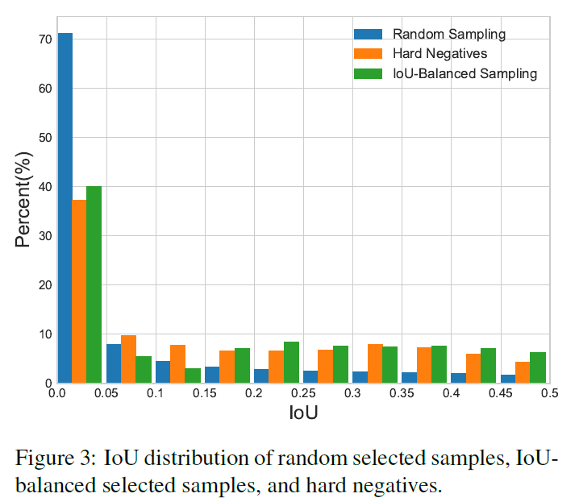
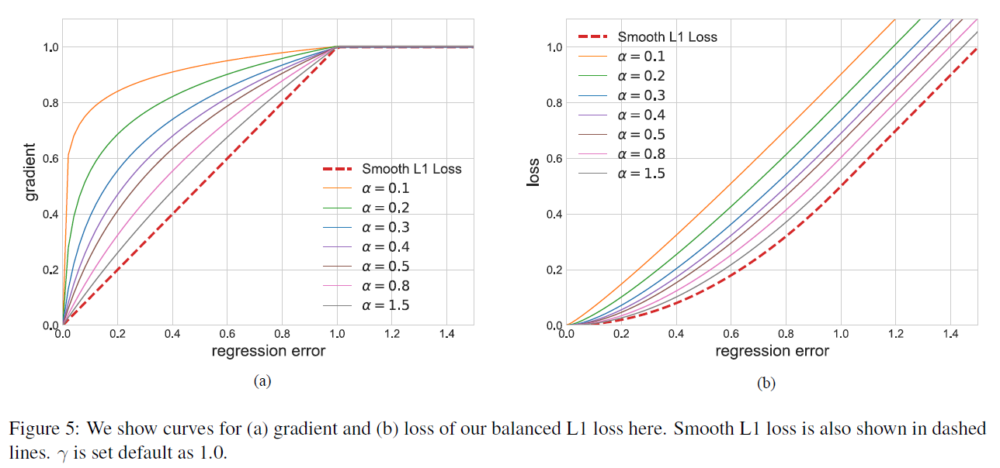
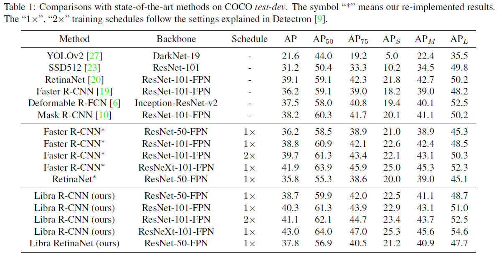
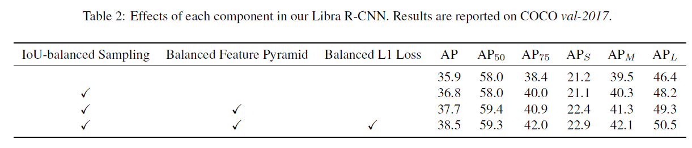
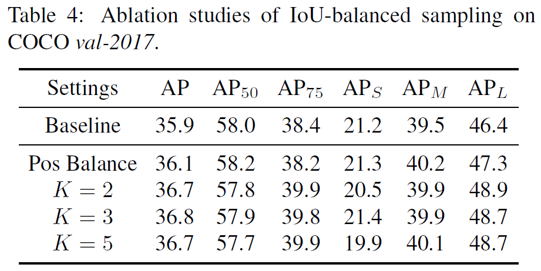
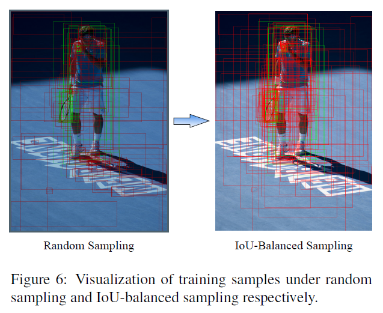

作者 | 文永亮

学校 | 哈尔滨工业大学（深圳）

研究方向 | 目标检测、GAN

## 推荐理由

​	这是一篇发表于**CVPR2019**的paper，是浙江大学和香港中文大学的工作，这篇文章十分有趣，网友戏称：“无痛涨点，实现简单，良心paper。”，在我看来确实是这样的，没有太大的改造结构，不需增加计算成本的条件下，居然能涨两个点**mAP**。除了本文解读的*Libra R-CNN*（天秤座 RCNN）**[1]**，我还记得陈恺他们港中文的实验室今年还中了一篇**CVPR2019**是*《Region Proposal by Guided Anchoring》***[2]**，这篇也是不错的，看题目就知道是指导anchor的形状涨分的了。

​	这两篇改进的源码都会在github上放出，作者表示还在完善中，地址是：<https://github.com/open-mmlab/mmdetection>

## 三个不平衡

纵观目前主流的目标检测算法，无论SSD、Faster R-CNN、Retinanet这些的detector的设计其实都是三个步骤：

* 选择候选区域
* 提取特征
* 在muti-task loss下收敛

往往存在着三种层次的不平衡：

 * **sample level**
 * **feature level**
 * **objective level**

这就对应了三个问题：

 * 采样的候选区域是否具有代表性？
 * 提取出的不同level的特征是怎么才能真正地充分利用？
 * 目前设计的损失函数能不能引导目标检测器更好地收敛？

​	其实如果不对detector的结构做功夫的话，针对这些imbalance改进的其实就是为了把detector的真正功效给展现出来，就是如果把一个目标检测器train好的问题。

## 对应的三个改进

* ###  IoU-balanced Sampling

​	作者认为sample level的不平衡是因为随机采样造成的，Ross Girshick后面提出了*OHEM*（online hard example mining，在线困难样本挖掘）是一个**hard negative mning**的一种好方法，但是这种方法对噪音数据会比较敏感。随机采样造成的不平衡可以看下图：

​	作者发现了如果是随机采样的话，随机采样到的样本超过70%都是在IoU在0到0.05之间的，有人会问不是随机吗？为什么大部分样本都落在了IOU较小的部分了呢？因为样本的分布在IoU上并不是均匀分布的，生成候选框时随机采样会造成背景框远远大于框中GT的框，一张图这么大，是目标物体的区域只占很小一部分，背景占了绝大多数的位置，所以大部分样本都挤在了IoU在0到0.05的区间了，作者觉得这里就是不科学的地方，统计得到的事实是60%的**hard negative**都落在IoU大于0.05的地方，但是随机采样只提供了30%。所以作者提出了**IoU-balanced Sampling**。

​	随机采样就是比如你要选N个hard negative，有M个候选框，选中的概率就是:
$$
p = \frac{N}{M}
$$

  ​	如果一共还是要采样N个，通过IoU的值划分为K个区间，每个区间中的候选采样数为$M_k$，则**IoU-balanced sampling**的采样公式即为：

$$
p_{k}=\frac{N}{K} * \frac{1}{M_{k}}, \quad k \in[0, K)
$$

  ​	作者通过在IoU上均匀采样， 把hard negative在IoU上均匀分布，在COCO数据集上达到的效果比*OHEM*的要好，并且这样简单很多。

* ### Balanced Feature Pyramid

  ​	feature level的不平衡表现在low/high level特征的利用上，如何利用不同分辨率的特征，分为了四步：**rescaling**，**integrating**，**refining**，**strengthening**。

1. *rescaling & integrating* :

   ​	假设$C_l$表示第$l$层特征，越高层分辨率越低，若有$｛C_2, C_3, C_4, C_5｝$的多层特征，$C_2$分辨率最高，我们知道低层特诊分辨率高往往学习到的是细节特征，高层特征分辨率低学习到语义特征，把四层特征resize到中间层次的$C_4$的size，然后后面再做简单的相加取平均操作：
$$
C=\frac{1}{L} \sum_{l=l_{\min }}^{l_{\max }} C_{l}
$$

​		就是这样简单的操作并没有引入什么计算就可以实现，最终在AP上也得到了验证是有效的。

2. *refining & strengthening*：

   ​	rescaling后取平均提取到的的特征还可以进一步地refine成更discriminative，作者这里用到了non-local模块，paper中使用了**Gaussian non-local attention [4]**增强integrate后的特征。

​	就像**Figure 4**画的一样，这样提取的特征其实与FPN可以一同使用，是作为feature pyramid的补充，作为一种增强手段。

* ###  Balanced L1 Loss

​	**Fast R-CNN [5]**中是通过multi-task loss解决Classification（分类）和Localization（定位）的问题的，定义如下：

$$
L_{p, u, t^{u}, v}=L_{c l s}(p, u)+\lambda[u \geq 1] L_{l o c}\left(t^{u}, v\right)
$$

​	$L_{cls}$ 和$L_{loc}$ 分别对应着分类和定位的损失函数， $p$ , $u$ 分别是$L_{cls}$ 的预测和目标，$t^u$是对应$u$类的回归结果。 $v$是回归目标。 $\lambda$用于在多任务学习下调整损失权重。

​	之所以会提出Balanced L1 loss，是因为这个损失函数是两个loss的相加，如果分类做得很好地话一样会得到很高的分数，而导致忽略了回归的重要性，一个自然的想法就是调整$\lambda$ 的值。我们把样本损失大于等于1.0的叫做outliers，小于的叫做inliers。由于回归目标是没有边界限制的，直接增加回归损失的权重将会使模型对outliers更加敏感。对于outliers会被看作是困难样本（hard example），这些困难样本会产生巨大的梯度不利于训练得过程，而inliers被看做是简单样本（easy example）只会产生相比outliers大概0.3倍的梯度。

​	首先我们看Smooth L1 Loss：
$$
L1_{smooth} = \left\{\begin{array}{ll}0.5x^2 & {\text{|x|<1} (inliers)}\\|x|-0.5 & {\text{otherwise(outliers)}}\end{array}\right.
$$

$$
\frac{\partial L1_{smooth}}{\partial x} = \left\{\begin{array}{lll} x & \text{|x|<1}\\ -1 & \text{x<-1} \\ 1 & \text{x>1} \end{array}\right.
$$

​	所以作者从常见的Smooth L1 Loss中推导出了Balanced L1 Loss：

​	
$$
L_{l o c}=\sum_{i \in\{x, y, w, h\}} L_{b}\left(t_{i}^{u}-v_{i}\right)
$$

​	它的梯度计算遵从下面的准则：
$$
\frac{\partial L_{l o c}}{\partial w} \propto \frac{\partial L_{b}}{\partial t_{i}^{u}} \propto \frac{\partial L_{b}}{\partial x}
$$

​	作者从需求出发，想要得到一个梯度当样本在$|x|<1$附近产生稍微大点的梯度，作者设计了下面这个函数，从**Figure 5**可以看出$\alpha\ln (b|x|+1)$大于x。
$$
\frac{\partial L_{b}}{\partial x}=\left\{\begin{array}{ll}{\alpha \ln (b|x|+1)} & {\text { if }|x|<1} \\ {\gamma} & {\text { otherwise }}\end{array}\right.
$$

​	根据梯度反求出$L_{b}(x)$ 表达式：
$$
L_{b}(x)=\left\{\begin{array}{ll}{\frac{\alpha}{b}(b|x|+1) \ln (b|x|+1)-\alpha|x|} & {\text { if }|x|<1} \\ {\gamma|x|+C} & {\text { otherwise }}\end{array}\right.
$$

​	还有很重要的一点就是为了函数的连续性，需要满足x=1时$L_{b}(1)=\gamma$:
$$
\alpha \ln (b+1)=\gamma
$$

​	其实意思就是$b=e^{\frac{\gamma}{\alpha}}$.

​	这个函数不得不说非常妙，成功掰弯了梯度，我也不知道他怎么想出来的。

## 实验结果

​	在COCO test-dev数据集上与目前state-of-the-art的目标检测的方法对比，能比Faster R-CNN、RetinaNet、Mask R-CNN要高2+的AP。

​	

​	三种解决方案的各种组合情况的对比实验：

​	值得注意的是，作者对IoU-balanced samping做实验时对K的取值做了实验证明该方法对K的取值并不敏感，即对IoU分多少个区间并不敏感。

​	这是IoU-balanced sampling的候选框的可视化效果：

​	

## 总结

​	paper逻辑清晰，紧紧抓住三个层次去做改进，三个问题对应三个解决方案，结构清晰一目了然，实验充分，相比两个单阶段和两阶段检测器的两个代表Faster R-CNN和RetinaNet分别高了2+的AP，图画得也不错，我觉得是篇好论文，而且应该是作者在比赛中实际运用到的才写出了这篇paper，以后目标检测的比赛我觉得都可以参考这篇去做改进。

## 参考文献

[1]. Pang J, Chen K, Shi J, et al. Libra R-CNN: Towards Balanced Learning for Object Detection[J]. arXiv preprint arXiv:1904.02701, 2019.

[2]. Wang J, Chen K, Yang S, et al. Region proposal by guided anchoring[J]. arXiv preprint arXiv:1901.03278, 2019.

[3]. Shrivastava A, Gupta A, Girshick R. Training region-based object detectors with online hard example mining[C]//Proceedings of the IEEE Conference on Computer Vision and Pattern Recognition. 2016: 761-769.

[4]. Wang X, Girshick R, Gupta A, et al. Non-local neural networks[C]//Proceedings of the IEEE Conference on Computer Vision and Pattern Recognition. 2018: 7794-7803.

[5]. Ross Girshick. Fast r-cnn. In IEEE Conference on Computer Vision and Pattern Recognition, 2015.

