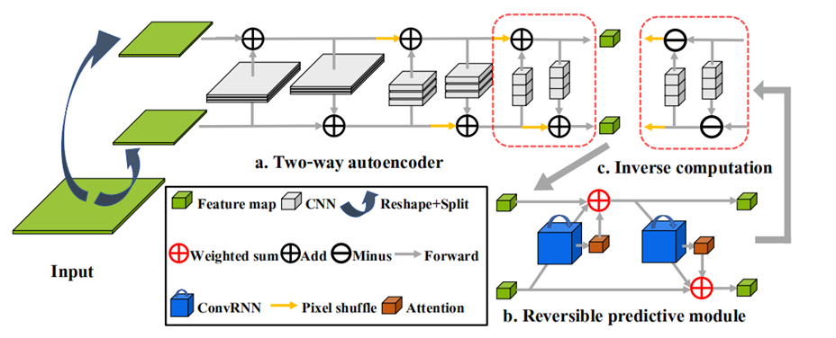
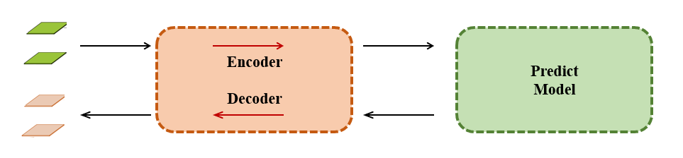
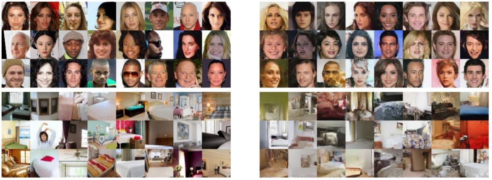
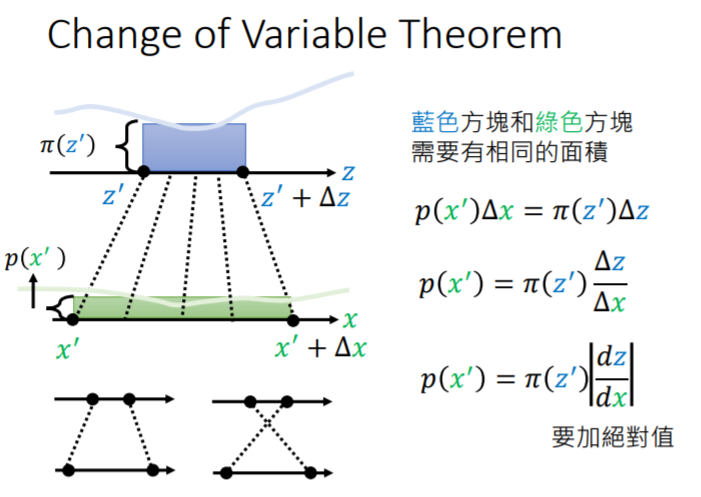
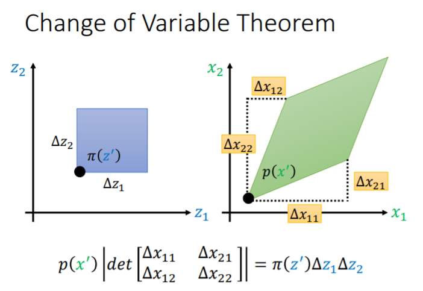
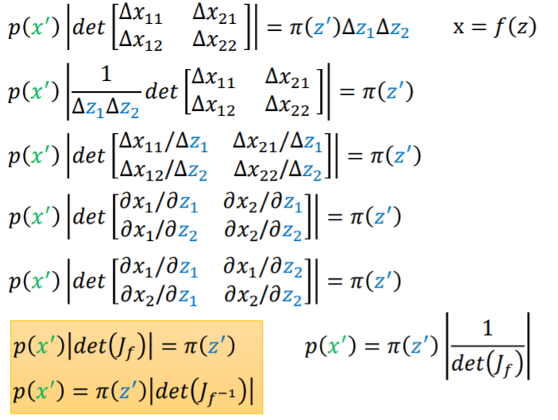
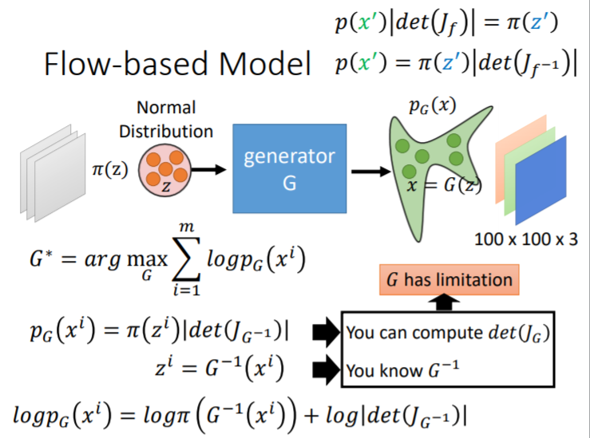
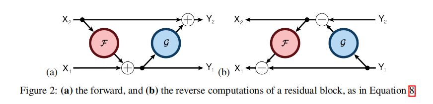
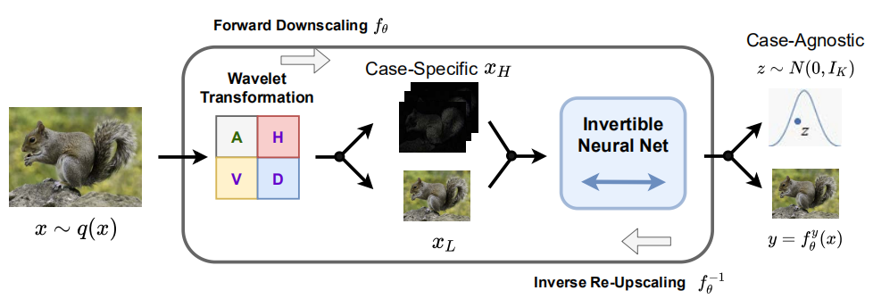
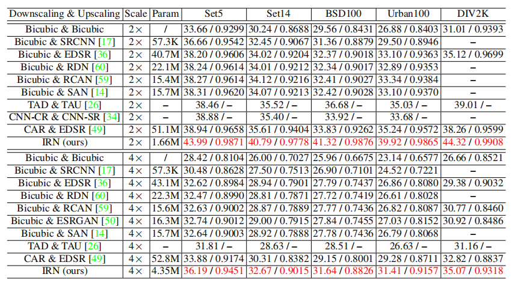

# 神经网络的可逆形式

最近在积累，好久没有写文章回顾一下了，近来我迷上了可逆网络，一开始是从[CrevNet](https://openreview.net/forum?id=B1eY_pVYvB)入坑的，这是一篇关于用了可逆网络的视频预测的方法。

其实简单的解释这个模型就是在预测生成模型之前把图片编码了一遍，如下图所示：

其中比较神奇的地方就是这个编解码器，这个编解码器就是由可逆网络的各个可逆模块构成的，同一个网络权重，既可以编码也可以解码。需要了解可逆网络最常用的设计，就能清楚地知道图片时如何编码成不同的形态，又能无损的解码回来。

## 可逆编解码

像是最常见的autoencoder，是由两个神经网络构成的，一个编码器，一个解码器。这里我介绍一种最简单的可逆编解码形式，如上图。

右侧方向为编码，假如数据一分为二$(x_1,x_2)$，其编码公式如下：
$$
y_1=x_1+F(x_2)
$$

$$
y_2=x_2
$$

其解码公式如下：
$$
x_2 = y_2
$$

$$
x_1 = y_1-F(y_2)
$$

我们深入浅出的说，这里编码过程和解码过程很容易看懂，只要保留一部分数据其实就可以复原另一部分。这里的**F可以任意复杂函数**，可以是卷积，或者其他网络。

但是其中的原理是非常深奥的，从一系列的flow-based模型，[NICE](http://scholar.google.co.jp/scholar_url?url=https://www.academia.edu/download/32800099/Chung_et_al_2013_NICE.pdf&hl=zh-CN&sa=X&ei=jsaSX8zbEcS9yQTZ0LeIDA&scisig=AAGBfm2qTY3_ZOMscxQPcOu5TTOMcTviUQ&nossl=1&oi=scholarr)，[RealNVP](https://arxiv.org/pdf/1605.08803.pdf),[Glow](https://papers.nips.cc/paper/8224-glow-generative-flow-with-invertible-1x1-convolutions.pdf)的提出，可以看到他们在生成领域的效果非常接近GAN模型了，但是确实还欠缺了一些。

在生成效果上他的不足主要是对模型限制很大，为什么这么说，这就要指出**可逆网络的性质**：

-   网络的输入输出shape必须一致（C x H x W，乘积一致）
-   网络的雅可比行列式不为0

为什么神经网络会与雅可比行列式有关系？这里我借用李宏毅老师的[ppt](https://speech.ee.ntu.edu.tw/~tlkagk/courses/ML_2019/Lecture/FLOW%20(v7).pdf)，想看视频的可以到[b站](https://www.bilibili.com/video/av57901914/)上看。

简单的来讲就是$x=f(z)$，他们的分布之间的关系就变为$p(x)=\pi(z)|det(J_{f^{-1}})|$，

又因为有$|det(J_{f^{-1}})|=1/|det(J_f)|$，所以$f$这个网络的雅可比行列式不为0才行。

顺便提一下，flow-based Model优化的损失函数如下：

其实这里跟矩阵运算很像，**矩阵可逆的条件也是矩阵的雅可比行列式不为0**，雅可比矩阵可以理解为矩阵的一阶导数。

回到一开始的可逆网络：
$$
y_1=x_1+F(x_2)
$$
$$
y_2=x_2
$$
它的**雅可比矩阵**为：
$$
J_f=\left[
 \begin{matrix}
   \frac{\partial y_1}{\partial x_1} & \frac{\partial y_1}{\partial x_2} \\
   \frac{\partial y_2}{\partial x_1} & \frac{\partial y_2}{\partial x_2} \\
  \end{matrix}
  \right]
  =
  \left[
 \begin{matrix}
   1 & \frac{\partial F}{\partial x_2} \\
   0 & 1 \\
  \end{matrix}
  \right]
  
$$
其行列式为1。

## 可逆形式

但是有一些可逆网络的论文，算出来的的雅可比矩阵并不是恰好为1，很难证明恒不等于0，但是仍然有用的设计方法，如[**The Reversible Residual Network:**

**Backpropagation Without Storing Activations**](https://arxiv.org/abs/1707.04585): 

其**编码**公式如下：
$$
y_1=x_1+F(x_2)
$$

$$
y_2=x_2+G(y_1)
$$

其**解码**公式如下：
$$
x_2 = y_2-G(y1)
$$

$$
x_1 = y_1-F(y_2)
$$

为了计算雅可比矩阵，我们更直观的写成下面的编码公式：
$$
y_1=x_1+F(x_2)
$$

$$
y_2=x_2+G(x_1+F(x_2))
$$

它的**雅可比矩阵**为：
$$
J_f=\left[
 \begin{matrix}
   \frac{\partial y_1}{\partial x_1} & \frac{\partial y_1}{\partial x_2} \\
   \frac{\partial y_2}{\partial x_1} & \frac{\partial y_2}{\partial x_2} \\
  \end{matrix}
  \right]
  =
  \left[
 \begin{matrix}
   1 & \frac{\partial F}{\partial x_2} \\
   \frac{\partial G}{\partial x_1} & 1+\frac{\partial G}{\partial F}\frac{\partial F}{\partial x_2} \\
  \end{matrix}
  \right]
$$
其行列式就很难证明不为0了，姑且算为一种可以可逆的网络设计方式，也就是一种可逆形式。

另外最新的一篇ECCV2020的[Invertible-Image-Rescaling](https://github.com/pkuxmq/Invertible-Image-Rescaling)（图像可逆缩放）的可逆形式的设计也让我觉得无法证明雅可比行列式为0，但是作者也说了这里并不是用作生成模型，只是作为图像缩放的工具。这篇论文的观点是非常新颖的，让我对这个方向有点新的感悟。

他是用在了SR（超分辨重构）的任务上，但是最后对比实验并不是真正的SR。他的insight是把误差给分离量化出来，用可逆网络的上下两个通路表达为误差和缩放后的图，反向传递的时候就是把**误差从正态分布中采样**，与LR图反向生成HR图。

这里为什么说不是SR任务呢，因为他这里的LR是由HR直接生成了又反向传递回去，而与之对比的是生活中产生的LR图想要得到HR图，或者说是Bicubic-based LR 想得到HR图，所以与之对比的是有些不公平。

但是作者解释道，**这个可逆网络主要用在有HR图想要在传输时降低分辨**，这确实可以解释地通，但是我觉得想要传输时其实直接压缩就好了，他这个既不是压缩也不是SR就有点奇怪。

